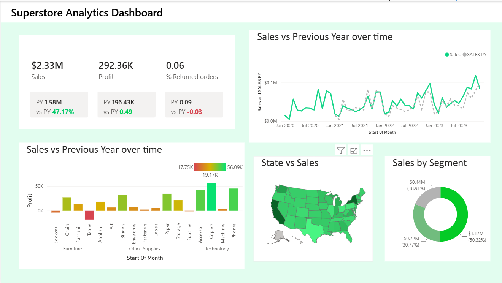

# Superstore Analytics Dashboard | Power BI

An interactive Power BI dashboard analyzing sales, profit, and returns performance for a retail superstore, with year-over-year trend tracking and segment/geographic breakdowns.



## Business Problem

Retail leadership needs a single view to track sales and profit health, spot underperforming categories, and monitor return rates — without digging through raw spreadsheets every week.

## Tools & Skills Used

- **Power BI Desktop** — data modeling, DAX measures, report design
- **Power Query** — data cleaning and transformation
- **DAX** — YoY comparison measures, % return rate calculation
- **Data Visualization** — KPI cards, time series, geo-mapping, donut charts

## Dashboard Features

- **KPI Cards** — Sales, Profit, and % Returned Orders with PY (Previous Year) comparison and % change
- **Sales vs Previous Year (Time Series)** — monthly trend line, current year vs PY overlay
- **Profit by Sub-Category** — color-coded bar chart (red = loss, green = high profit) across Furniture, Office Supplies, and Technology
- **State vs Sales** — US map, shaded by sales volume
- **Sales by Segment** — donut breakdown across Consumer, Corporate, and Home Office

## Key Insights

- **Total Sales: $2.33M**, up **47.17% YoY** (from $1.58M)
- **Total Profit: $292.36K**, up **~49% YoY** (from $196.43K)
- **Return rate improved to 6%**, down from 9% PY (-3 percentage points)
- **Consumer segment drives 50.32% of sales** ($1.17M), followed by Corporate (30.77%) and Home Office (18.91%)
- **Technology sub-categories (Copiers, Phones, Accessories) are the strongest profit drivers**
- **Furniture — specifically Tables and Bookcases — are running at a loss**, flagging a pricing/discounting issue worth investigating

## Recommendations

- Audit discount levels on Tables and Bookcases; they're actively eroding margin
- Double down on Technology category marketing given its outsized profit contribution
- Investigate low-performing states on the map for targeted regional promotions

## Repo Contents

```
├── Superstore_Dashboard.pbix     # Power BI report file
├── screenshot                  # Dashboard screenshots
└── README.md
```

## Dataset

Sample Superstore dataset (public retail dataset, commonly used for BI/analytics portfolio projects).

## Made by

**Shiv Salunke**
[GitHub](https://github.com/Shiv-x0) · [LinkedIn](https://linkedin.com/in/shiv-salunke)
